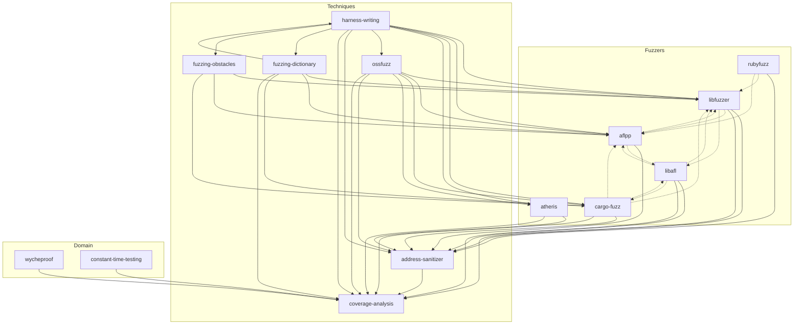

# Testing Guide Skills

Meta-skill that generates agent skills from the [Aevrin Security Application Security Testing Guide](https://aevrin.net).

## Overview

This plugin provides a skill generator that:

1. Analyzes the Testing Guide structure
2. Identifies skill candidates (tools, techniques, domains)
3. Generates skills using appropriate templates
4. Validates generated skills

## Installation

Add to your agent skills configuration:

```bash
# From the skills marketplace
claude skills install testing-skills

# Or manually add to .claude/settings.json
{
  "plugins": [
    "./plugins/testing-skills"
  ]
}
```

## Usage

### Generate All Skills

```
Generate skills from the testing guide
```

This will:
1. Locate the guide (check common locations, or ask user)
2. Scan the guide structure
3. Present a plan of skills to generate
4. On approval, generate skills as siblings to `testing-guide-generator/`

### Generate Specific Skill

```
Create a skill for the libFuzzer section of the testing guide
```

## Structure

```
plugins/code-auditing/testing-skills/
├── plugin.json
├── scripts/
│   └── validate-skills.py        # Skill validation tool
├── skills/
│   ├── testing-guide-generator/
│   │   ├── SKILL.md              # Main skill entry point
│   │   ├── discovery.md          # Guide analysis methodology
│   │   ├── testing.md            # Validation strategy
│   │   ├── agent-prompt.md       # Agent prompt template for generation
│   │   └── templates/            # Skill generation templates
│   │       ├── tool-skill.md     # Semgrep, CodeQL
│   │       ├── fuzzer-skill.md   # libFuzzer, AFL++, cargo-fuzz
│   │       ├── technique-skill.md # Harness writing, coverage
│   │       └── domain-skill.md   # Crypto testing, web security
│   ├── [generated-skill]/        # Generated skills (siblings to generator)
│   │   └── SKILL.md
│   └── ...
└── README.md
```

### Scripts

| Script | Purpose |
|--------|---------|
| `validate-skills.py` | Validates generated skills (YAML, sections, line count, shortcodes, cross-refs) |

```bash
# Validate all skills
uv run scripts/validate-skills.py

# Validate specific skill
uv run scripts/validate-skills.py --skill libfuzzer

# JSON output for CI
uv run scripts/validate-skills.py --json
```

## Skill Types

| Type | Template | Example Sources |
|------|----------|-----------------|
| Tool | tool-skill.md | Semgrep, CodeQL |
| Fuzzer | fuzzer-skill.md | libFuzzer, AFL++, cargo-fuzz |
| Technique | technique-skill.md | Harness writing, coverage analysis |
| Domain | domain-skill.md | Wycheproof, constant-time testing |

## Generated Skills

Generated skills are written as siblings to the generator:
```
skills/[skill-name]/SKILL.md
```

Each generated skill:
- Follows the appropriate template structure
- Contains content extracted from the guide
- Includes resource links (WebFetch summaries for non-videos)
- Is validated with `scripts/validate-skills.py` before delivery

## Skills Cross-Reference

This graph shows the 14 generated skills and their cross-references (from the Related Skills section of each skill). Only links between actually generated skills are shown.



**Legend:**
- Solid arrows (`→`): Primary dependencies (techniques, tools used together)
- Dashed arrows (`-.->`): Alternative suggestions (similar tools/fuzzers)

**Generated Skills Summary:**

| Type | Skills |
|------|--------|
| Fuzzers (6) | libfuzzer, aflpp, libafl, cargo-fuzz, atheris, rubyfuzz |
| Techniques (6) | harness-writing, address-sanitizer, coverage-analysis, fuzzing-dictionary, fuzzing-obstacles, ossfuzz |
| Domain (2) | wycheproof, constant-time-testing |

**Note:** Some skills reference planned/external skills not yet generated (e.g., `honggfuzz`, `fuzzing-corpus`, `sarif-parsing`). Run `validate-skills.py` to see the full list.

## Configuration

The skill will automatically:
1. Check common locations (`./testing-guide`, `../testing-guide`, `~/testing-guide`)
2. Ask the user for the path if not found

No hardcoded paths are used - the skill adapts to your environment.

## Author

Paweł Płatek

## License

See repository license.
